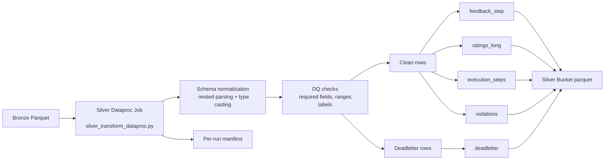

# Bronze to Silver End-to-End Guide (Current Executed Flow)

## Why this document exists
This document is the practical, technical guide for what we implemented from **Bronze to Silver**.
It is written in simple language but keeps deep engineering detail so you can:
- explain design choices in interviews,
- operate the pipeline safely,
- troubleshoot failures quickly,
- and extend Silver without breaking contracts.

---

## 1) One-minute summary

At Silver, we convert Bronze parquet into **clean, contract-driven analytical tables**.

What Silver now does:
1. Reads Bronze parquet for a specific `ingest_date` and optional `run_id`.
2. Normalizes nested fields (ratings, execution payload, violations, auto-rater).
3. Applies data quality checks and sends bad rows to deadletter.
4. Produces 5 Silver output tables in parquet.
5. Writes a per-run manifest and enforces rerun guard (idempotency).

---

## 2) Silver architecture flow

---

## 3) What is “Silver” in simple words

Silver is the stage where data becomes **reliable for downstream use**.

- Bronze = lightly standardized, still close to source shape.
- Silver = contract-aligned, quality-checked, and analysis-ready.

Technical terms (simple):
- **Contract**: expected schema and rules (field names/types/ranges).
- **DQ (Data Quality)**: checks to detect bad or suspicious records.
- **Deadletter**: storage for records that fail DQ.
- **Idempotency**: rerunning the same data does not create duplicate bad state.

---

## 4) Implemented code and scripts

Core files:
- `src/silver/silver_transform_dataproc.py`
- `src/silver/__init__.py`
- `scripts/run_silver_dataproc.sh`
- `tests/test_silver_transform.py`

What each does:

### `silver_transform_dataproc.py`
- Reads Bronze parquet.
- Filters by `ingest_date`, `run_id`, `batch_name` when provided.
- Normalizes and parses nested structures.
- Calculates final resolved scores.
- Applies DQ checks.
- Writes 5 Silver output tables + per-run manifest.

### `run_silver_dataproc.sh`
- Uploads latest Silver job to GCS jobs path.
- Submits Dataproc Serverless batch with runtime args.
- Keeps same operational style as Bronze runner.

### `test_silver_transform.py`
- Unit tests for score resolution logic.
- Unit tests for DQ behavior.
- Unit tests for child table explosion logic.

---

## 5) Silver output data model (5 tables)

Silver writes these folders/tables:

1. `feedback_step`
2. `ratings_long`
3. `execution_steps`
4. `violations`
5. `deadletter`

### 5.1 `feedback_step` (main fact-like Silver table)
Grain: **one row per evaluated step**.

Contains:
- lineage: `ingest_date`, `run_id`, `record_hash`, `schema_hash`, `raw_path`
- business context: `task_type`, `prompt_id`, `step_type`, `evaluated_step_index`
- model fields: `model_version`, `final_answer`, auto-rater metadata
- final resolved metrics: `final_primary_intent`, etc.
- quality columns: `dq_pass`, `dq_reasons`

### 5.2 `ratings_long`
Grain: **one row per (record + metric + rater)**.

Why this is useful:
- easy model analytics (`GROUP BY metric_name, rater_type`)
- easy agreement/delta calculations
- no wide-table complexity for BI

### 5.3 `execution_steps`
Grain: **one row per tool/trajectory step from execution_json.steps**.

Why useful:
- step-level behavior analysis
- tool usage patterns
- debugging where a response trajectory failed

### 5.4 `violations`
Grain: **one row per violation event**.

Sources included:
- top-level record violations
- auto-rater violations

### 5.5 `deadletter`
Grain: **one row per failed Silver record**.

Contains:
- failure reasons list
- key identifiers
- serialized raw record snapshot

---

## 6) Internal cleaning and transformations (deep details)

### 6.1 Parsing and normalization
- Parses JSON strings to structs for:
  - curator/reviewer ratings,
  - `auto_rater`,
  - `execution_json`.
- Normalizes violations into `array<string>` regardless of source format.
- Trims whitespace for string columns.
- Casts numeric step indices.

### 6.2 Final score resolution logic
For each metric:
- reviewer score overrides curator score when present,
- if both raters available, average is computed,
- if only one side available, that value is used,
- if neither exists, null remains.

Final label precedence:
1. reviewer curator 1 label
2. reviewer curator 2 label
3. curator 1 label
4. curator 2 label
5. auto-rater label

### 6.3 DQ checks implemented

Record fails if any of these happen:
- missing `run_id`
- missing `record_hash`
- missing `prompt_id`
- missing `query_text`
- missing `evaluated_step_index`
- negative `evaluated_step_index`
- invalid `final_overall_label`
- metric out of range (must be within 0..5)

### 6.4 Deadletter routing
- Failed rows go to `deadletter` with `dq_reasons`.
- Passed rows continue to normal Silver outputs.

---

## 7) Idempotency and rerun safety

Silver rerun guard:
- Before write, job checks manifest path:
  - `.../silver/ingest_date=YYYY-MM-DD/_manifests/run_id=<run_id>.json`
- If manifest exists, job fails fast.

Why this matters:
- prevents duplicate append writes for same run,
- keeps analytics trustworthy.

---

## 8) Partitioning strategy

Current write strategy:
- parquet append mode
- partition by `ingest_date`

Why:
- day-level operational slicing
- manageable partition cardinality
- predictable query filtering pattern

---

## 9) Executed validation (real run evidence)

Silver run validated on Dataproc Serverless.

Example validated counts from manifest:
- `feedback_step`: 162
- `ratings_long`: 972
- `execution_steps`: 952
- `violations`: 43
- `deadletter`: 0

Another validated run:
- run_id `04ace1a6-27c1-4167-8148-fc2a7e4799b1`
- ingest_date `2026-02-21`
- manifest successfully written

---

## 10) Testing strategy and quality signals

Implemented tests in `tests/test_silver_transform.py`:

1. **Score resolution test**
   - verifies reviewer override + averaging behavior.

2. **DQ failure test**
   - verifies missing fields/out-of-range values are flagged.

3. **Child table construction test**
   - verifies nested steps and violations explode correctly.

Result status:
- Silver tests pass.
- Dataproc runtime run also pass.

Interpretation:
- both logic-level quality and runtime-level quality are validated.

---

## 11) Common failure patterns we saw and fixed

### Issue A: `ingest_date` not found
Cause:
- `recursiveFileLookup=true` dropped partition columns.

Fix:
- switched to standard parquet read to preserve partition inference.

### Issue B: struct cast mismatch on nested field ordering/types
Cause:
- direct struct cast was brittle when source struct layout differed.

Fix:
- normalize via `to_json -> from_json(target_schema)`.

### Issue C: PySpark null-array handling in DQ reason collection
Cause:
- old null removal method triggered column iterable error.

Fix:
- replaced with higher-order `filter` over array expression.

---

## 12) Operational runbook (Bronze -> Silver)

1. Ensure Bronze data exists for target date/run.
2. Submit Silver Dataproc job using script.
3. Validate job completed in Dataproc batch logs.
4. Validate manifest exists and row counts look correct.
5. Validate deadletter behavior (should be expected, not random).
6. Run unit tests locally/CI for change confidence.

---

## 13) Interview deep-dive Q&A (with cross-questions)

### Q1) Why split into multiple Silver tables instead of one wide table?
**Answer:**
Because data has different grains. `feedback_step` is step-level core; `ratings_long` is metric/rater grain; `execution_steps` and `violations` are exploded child entities. This avoids sparse columns and simplifies analytics.

**Cross-question:** Why not keep nested arrays and query directly?
**Answer:** You can, but repeated nested scans are costly and harder for BI tools. Exploded tables improve query clarity and performance.

---

### Q2) How is idempotency enforced at Silver?
**Answer:**
Per-run manifest guard. If a manifest for `run_id + ingest_date` exists, job aborts before write.

**Cross-question:** What if manifest exists but write was partial?
**Answer:** In stricter production, manifest should be written only after all writes + optional validation checks. We already write it after table writes; next hardening step can add atomicity patterns/checkpoints.

---

### Q3) Why deadletter instead of dropping bad rows silently?
**Answer:**
Silent drops hide data loss. Deadletter preserves failed records and reasons, enabling auditability and remediation.

**Cross-question:** Won’t deadletter increase storage cost?
**Answer:** Yes slightly, but it is small compared to trust and recoverability benefits.

---

### Q4) How do you handle schema drift in Silver?
**Answer:**
Known contract fields are parsed and validated. Unstable nested source shapes are normalized through schema parsing logic. Breaking changes surface through DQ and errors instead of silent corruption.

**Cross-question:** Additive new fields?
**Answer:** Usually non-breaking, but downstream select lists should be updated if fields are business-critical.

---

### Q5) How do you prove quality in interviews?
**Answer:**
I show both:
1) Unit tests for transformation behavior,
2) Dataproc executed run + manifest row counts + zero/unexpected deadletter checks.

---

## 14) Glossary (simple)

- **Grain**: the meaning of one row.
- **Explode**: convert array items into multiple rows.
- **Manifest**: run summary JSON metadata.
- **Contract-driven**: pipeline follows a defined schema/rules contract.
- **Serverless Spark**: run Spark jobs without managing clusters manually.

---

## 15) What’s next after Silver

Next stage is Gold:
- training-ready curated table(s),
- model behavior analytics marts,
- BigQuery serving layer and dimensional analytics model.
