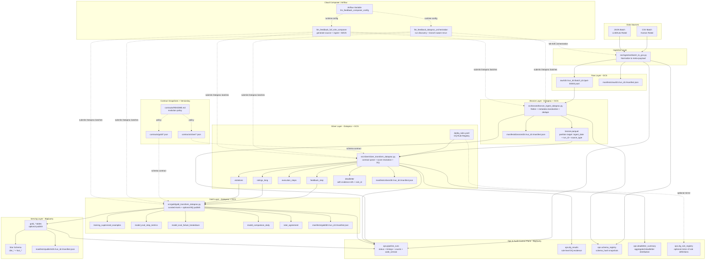
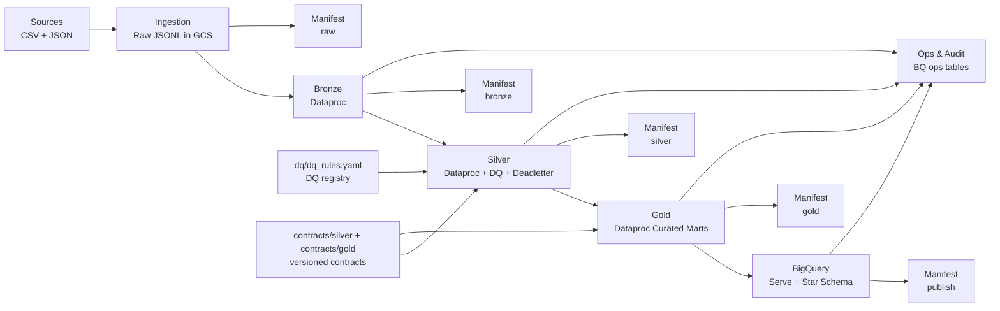

# End-to-End Pipeline Architecture Diagram

This diagram represents the implemented end-to-end flow in this repository.
It includes GenAI-readiness artifacts for future read-only consumption (ops control plane + evidence packaging), without introducing agentic/UI runtime changes.

## Rerun logic (implemented)
- If `manifests/gold/dt=<date>/run_id=<run_id>/manifest.json` exists: skip run.
- Else if `manifests/silver/dt=<date>/run_id=<run_id>/manifest.json` exists: run Gold only.
- Else if `manifests/bronze/dt=<date>/run_id=<run_id>/manifest.json` exists: run Silver then Gold.
- Else: run Bronze then Silver then Gold.
- Composer override: set `dag_run.conf.force_reprocess=true` to submit all stages for discovered runs and pass `--force` into stage jobs.

## Evidence packaging and lineage notes
- Every stage emits a standardized `{stage}_manifest.json` at `manifests/<stage>/dt=<date>/run_id=<run_id>/manifest.json`.
- Ops tables are source of truth for run status, DQ outcomes, schema snapshots, and deadletter aggregates.
- Lineage/version pointers (`input_paths`, `output_paths`, partition keys, `code_version`) are stored in manifests and `ops.pipeline_runs`.

## Simplified flow (presentation view)

### Simplified checkpoints
- Stage execution scope: `run_id`.
- Manifest path (all stages): `manifests/<stage>/dt=<date>/run_id=<run_id>/manifest.json`.
- Rerun default: skip if manifest exists; optional controlled force reprocess.
- Ops source of truth: `ops.pipeline_runs`, `ops.dq_results`, `ops.schema_registry`, `ops.deadletter_summary`.
