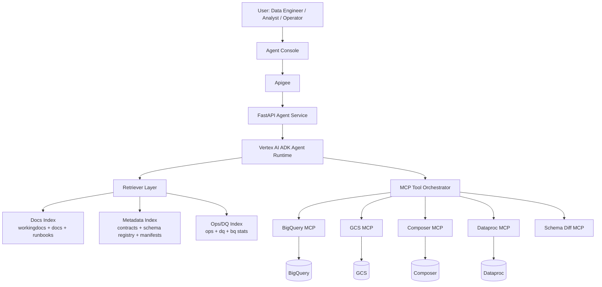

# Phase 2 BRD + Technical Design: Agentic RAG for LLM Feedback Data Platform

## Document purpose
Define the **next project phase** after Raw → Bronze → Silver → Gold orchestration is complete.
This document provides:
- business requirements,
- target Agentic AI architecture,
- phased implementation plan,
- tech stack decisions (ADK, MCP, LangChain/LangGraph, Gemini, Vertex AI),
- repository strategy (same repo vs separate repo),
- delivery and acceptance criteria.

---

## 1) Executive summary
You already built a strong data platform foundation (GCS + Dataproc + Airflow/Composer + BigQuery-ready outputs).

**Phase 2 objective** is to add an Agentic RAG layer that can:
1. answer deep operational/data questions from platform artifacts,
2. automate repetitive data engineering diagnostics and recommendations,
3. generate governed transformation/DQ suggestions,
4. generate draft proposal + notify outputs; changes are applied only after approval + CI gates.

The recommended path is:
- **Start in the same repository** (faster integration, lower overhead),
- build a modular `src/agents/` architecture,
- deploy production agent runtime on **Vertex AI**,
- use **Gemini + ADK + MCP tool orchestration** as primary stack,
- use **LangGraph** selectively for complex stateful multi-step workflows.

---

## 2) Current-state baseline (already completed)
Implemented and validated:
- Batch/API-aware ingestion into GCS Raw with canonical metadata envelope.
- Dataproc Bronze/Silver/Gold transformations with manifests and rerun guards.
- Airflow/Composer orchestration with dependency-aware reruns.
- Optional BigQuery publishing and star-schema analytics.

This gives Phase 2 a reliable substrate for retrieval grounding and tool-based automation.

---

## 3) Business requirements (BRD)

### 3.1 Business goals
- Reduce manual investigation time for pipeline failures and data-quality issues.
- Increase speed of onboarding and analysis for new datasets/schema drift.
- Improve confidence and traceability for transformation-rule changes.
- Provide an interview-grade, production-minded Agentic AI extension on top of the data platform.

### 3.2 Functional requirements
1. Agent can answer questions grounded in project docs + metadata + ops artifacts.
2. Agent can run tool-assisted diagnostics (manifests, DQ results, row-count drift, schema drift).
3. Agent can propose transformation/DQ rule changes with rationale and test impact.
4. Agent can generate draft proposal + notify runbook actions (safe by default).
5. Agent supports Human-in-the-Loop (HITL) approval for high-impact actions.
6. Agent interaction history and decisions are auditable.

### 3.3 Non-functional requirements
- **Reliability:** deterministic tool outputs and fallback behavior.
- **Security:** least-privilege IAM and secret isolation.
- **Observability:** request/response tracing, tool-call logs, token/cost metrics.
- **Performance:** acceptable response latency for analyst/operator workflows.
- **Governance:** prompt/version control, policy checks, and approval gates.

---

## 4) Problem map: what should be automated now

### 4.1 Current pain points (high-value automation targets)
1. **Failure triage latency**
   - Today: operator manually inspects Airflow + Dataproc + GCS artifacts.
   - Agent value: summarize root cause quickly and propose recovery path.

2. **Schema drift handling effort**
   - Today: drift analysis and contract update decisions are manual.
   - Agent value: detect drift class, map impacted tables/rules, propose patch.

3. **DQ investigation effort**
   - Today: manual SQL/log analysis for null/range/dup violations.
   - Agent value: run diagnostics, explain likely cause, suggest fixes.

4. **Transformation-rule evolution speed**
   - Today: converting business feedback into code changes is slow.
   - Agent value: generate candidate transformations/tests for review.

5. **Operational runbook dependency on individuals**
   - Today: troubleshooting knowledge is tribal.
   - Agent value: standardized playbooks and consistent triage output.

---

## 5) Agent responsibilities (what activities agents will do)

### 5.1 Agent catalog (MVP)

1. **Router/Coordinator Agent**
    - Single entrypoint for UI chat and event triggers.
    - Responsibilities:
       - classify intent (`ops`, `dq`, `drift`, `transform`, `governance`),
       - delegate to specialist agents (agent-to-agent calling),
       - compose final response format (Answer + Evidence + Suggested Actions + Confidence),
       - enforce grounding and policy checks before returning.

2. **Ops Copilot Agent**
    - Inputs: Composer run state, Dataproc job logs/metadata, manifests, ops tables.
    - Activities:
       - detect failed stage and dependency impact,
       - classify failure type (config/data/runtime/permission),
       - generate recovery guidance,
       - produce incident summary + evidence bundle.

3. **Data Quality Analyst Agent**
    - Inputs: Silver/Gold tables, DQ rule outputs, deadletter/quarantine data.
    - Activities:
       - explain DQ failures by rule and segment,
       - identify drift and outlier patterns,
       - propose rule adjustments with expected impact,
       - draft SQL validation queries (read-only templates in Phase 2A).

4. **Transformation Designer Agent (single agent, two modes/playbooks)**
    - Inputs: source contracts, schema registry, existing transform code/tests.
    - Mode A: **Bronze→Silver normalization**
       - enforce schema contracts + drift handling,
       - flatten/normalize nested fields,
       - standardize types and metadata propagation (`run_id`, `schema_hash`, `record_hash`, `ingest_ts`),
       - define dedup strategy and deterministic merge keys,
       - integrate DQ rules + deadletter/quarantine routing.
    - Mode B: **Silver→Gold curation**
       - define KPI/analytics logic (agreement, violation rates, trends),
       - produce dimensional/curated outputs,
       - run publish-readiness checks (BQ partitioning/clustering readiness).
    - Output model (Phase 2B+): proposal-first artifacts (mapping spec + tests + sample schema).
    - PR/code generation path: only after approvals + CI gates.
    - Optional internal implementation detail: `TransformSubAgent_B2S`, `TransformSubAgent_S2G`.

5. **Governance & Lineage Agent**
    - Inputs: contracts, decision logs, schema changes, run manifests.
    - Activities:
       - explain data lineage for any metric/table,
       - detect policy violations (missing metadata, unsafe writes),
       - generate compliance/audit summaries.

### 5.2 Agent-to-agent interoperability
- Router delegates to specialists through structured calls.
- Specialists return structured result objects (no free-form payload requirement).
- Shared context object across hops:
   - `run_id`,
   - `env`,
   - `dataset`,
   - `evidence_refs`,
   - `trace_id`.

### 5.3 Human-in-the-loop policy
- Read-only diagnostics: auto-run allowed.
- Config updates / code generation: require approval.
- Production-impacting actions (rerun triggers, DDL/DML, deployment): require explicit approval + role check.

---

## 6) Target architecture (Phase 2)



### 6.1 Architecture updates (Phase 2 revised)
End-to-end request path:

`UI (Agent Console) → Apigee → FastAPI Agent Service → Vertex AI ADK runtime (router + specialists) → Retriever + MCP tools → GCP systems (BQ/GCS/Composer/Dataproc)`

ASCII view:

```text
[Agent Console]
         |
    [Apigee]
         |
[FastAPI Agent Service]
         |
[ADK Runtime: Router -> Specialists]
         |
 [Retriever] + [MCP Tools]
         |
[BigQuery] [GCS] [Composer] [Dataproc]
```

Component roles:
- **Apigee**: OAuth/JWT auth, quota/spike arrest, routing, API versioning, request policies.
- **FastAPI Agent Service**: session handling, routing/agent selection, audit logging, tool-invocation mediation, RBAC enforcement, proposal lifecycle endpoints.
- **ADK runtime**: orchestration/runtime for router + specialist agents.
- **MCP layer**: standardized tool calls using strict schemas + allowlists.

---

## 7) RAG design details

### 7.1 Knowledge sources for retrieval
1. Project docs and working guides.
2. Source contracts + decision logs + definition of done.
3. Pipeline manifests and run summaries.
4. DQ rule definitions and outcomes.
5. Sample incidents and postmortems (to be added over time).

### 7.2 Retrieval strategy
- Hybrid retrieval:
   - semantic search (embeddings),
   - keyword/metadata filters (`ingest_date`, `run_id`, `stage`, `table`).
- Chunking:
   - docs: 500–1200 token chunks with heading-aware boundaries,
   - logs/manifests: structured chunks by run/stage.
- Reranking:
   - use lightweight reranker or model-based reordering for top-k precision.

### 7.3 Grounding controls
- Always attach source references (doc section or artifact path IDs).
- Reject high-confidence claims when no evidence is found.
- Separate “facts from retrieved context” vs “agent recommendation.”

---

## 8) Tooling and MCP orchestration design

### 8.1 Phase 2A hard gate: read-only tools only
**Phase 2A (MVP) = Read-only**

Allowed:
- read GCS manifests/schema registry/configs,
- query BigQuery via allowlisted templates (`SELECT` only),
- fetch Composer DAG run/task status (read),
- fetch Dataproc job status + logs (read),
- run schema diff computations (read-only).

Not allowed:
- rerun triggers,
- DML/DDL execution,
- writing config changes,
- PR creation/merge,
- automatic changes without approval.

Any actions beyond read-only require Phase 2B+ with approvals.

### 8.2 MCP tool contracts + allowlist registry
Every MCP tool contract must define:
- `tool_name`
- `purpose`
- `input_json_schema`
- `output_json_schema`
- `role_requirements`
- `allowed_operations`
- `error_model`

Allowlist Registry requirements:
- mapping: `tool_name -> allowed templates/actions -> roles`
- BigQuery restriction in Phase 2A:
   - parameterized SQL templates only,
   - no free-form SQL,
   - `SELECT` only.

Initial tool registry (Phase 2A):

| tool_name | Purpose | Allowed operations (2A) | Role requirements |
|---|---|---|---|
| `bq_select_template_query` | Query diagnostics/KPIs from BigQuery | Allowlisted parameterized `SELECT` templates only | `viewer`+ |
| `gcs_read_manifest` | Read manifests/schema registry/config snapshots in GCS | Read object + parse metadata | `viewer`+ |
| `composer_run_status_read` | Read Composer DAG/task run status | Read-only status lookup | `viewer`+ |
| `dataproc_job_status_read` | Read Dataproc job state and metadata | Read-only status lookup | `viewer`+ |
| `dataproc_job_logs_read` | Read Dataproc error/log snippets | Read-only log retrieval | `viewer`+ |
| `schema_diff_tool` | Compare expected vs observed schema | Read-only diff/classification | `operator`+ |

### 8.3 Tool safety model
- Tool contracts are strongly typed (Pydantic/dataclass schemas).
- Query allowlists / parameterized templates are mandatory.
- No destructive operation is exposed in Phase 2A.

### 8.4 Orchestration mode split
- **ADK-first orchestration:** default for straightforward tool calls.
- **LangGraph workflow mode:** used selectively for multi-turn stateful workflows:
   - incident triage,
   - proposal lifecycle progression,
   - approval checkpoint flows.

---

## 9) Recommended tech stack

### 9.1 Core stack (recommended)
- **Model:** Gemini 2.x family (Vertex AI hosted).
- **Agent framework:** Vertex AI ADK.
- **Gateway/API edge:** Apigee.
- **Agent service layer:** FastAPI (Cloud Run).
- **Tool protocol:** MCP servers for data/platform operations.
- **Workflow graph:** LangGraph (selective, only where needed).
- **LLM app utilities:** LangChain components (prompt templates, retrievers, tool wrappers).
- **Embeddings:** Vertex AI text embeddings.
- **Vector store:**
   - default: BigQuery vector search (fits current stack and governance),
   - optional later: Vertex AI Vector Search for lower latency/high scale.
- **Deployment/runtime:** Vertex AI endpoints + Cloud Run services for Agent Service + MCP servers.
- **Scheduling/orchestration:** Composer for data pipeline; agent jobs via Cloud Scheduler/Function/Run triggers as needed.
- **Observability:** Cloud Logging + OpenTelemetry traces + `ops.*` audit tables.

### 9.2 Optional additions (when scale increases)
- Redis for short-term conversation/session state cache.
- AlloyDB/Cloud SQL for richer proposal state and approval workflows.
- Policy engine (OPA-like) for explicit action constraints.

---

## 10) Repository strategy: same project vs separate project

## Decision
**Start in the same repository now**, with strict modular boundaries.

### Why this is best now
- Reuses existing pipeline code/contracts/docs immediately.
- Faster iteration for retrieval grounding and tool integration.
- Easier end-to-end test coverage across pipeline + agents.
- Lower DevOps overhead at current maturity.

### When to split into a separate repository
Split later if any 2+ conditions are true:
1. Different release cadence between data platform and agent runtime.
2. Separate ownership teams/on-call rotations.
3. Security boundary requires isolated IAM and deployment.
4. Agent codebase grows independently (MCP services, UI, workflow engine).

### Recommended near-term structure in same repo
- `src/agents/`
   - `core/` (router, specialists, prompts, policies)
   - `workflows/` (stateful flows)
   - `retrieval/` (indexing, chunking, embedding, reranking)
   - `tools/` (MCP client wrappers)
- `src/agent_service/` (FastAPI session/routing/audit/proposal endpoints)
- `mcp_servers/`
   - `bq_server/`, `gcs_server/`, `composer_server/`, `dataproc_server/`, `schema_server/`
- `configs/agents/`
- `tests/agents/`
- `docs/agents/` or `workingdocs/agentic/`

---

## 11) Phase-wise implementation roadmap (revised)

## Phase 2A: Read-only Ops Copilot MVP
- Router + Ops + DQ agents (read-only).
- MCP read-only tools with allowlists and strict schemas.
- Audit trail tables (`ops.agent_sessions`, `ops.agent_tool_calls`, `ops.agent_responses`, `ops.agent_proposals`).
- Retrieval evaluation harness with baseline thresholds.
- Agent Console basic chat (Ops/DQ first).

**Exit criteria:**
- Agent resolves top failure-triage queries with acceptable grounded evidence.
- No write/destructive tools enabled.

## Phase 2B: Proposal lifecycle + approvals
- Proposal object model + state machine.
- HITL workflows and approver controls.
- Transformation Designer in proposal-first mode.

**Exit criteria:**
- Agent can produce reviewable/testable proposal artifacts.
- Approval gates and proposal audit logs are active.

## Phase 2C: PR automation + CI gates
- PR creation tool behind explicit approval state.
- CI validations: unit tests + DQ regression gates + retrieval regression gates.

**Exit criteria:**
- PR automation is policy-constrained and consistently auditable.
- CI gates prevent unsafe merges.

## Phase 2D: Optional guarded automation
- Limited low-risk execution paths (non-prod-first, policy-constrained).
- Production paths remain approval-based.

**Exit criteria:**
- Safety, compliance, and rollback controls are proven under drills.

---

## 12) Detailed end-to-end flow (future-state)

1. User asks operational/data question in Agent Console, or an event trigger starts a run.
2. Router/Coordinator Agent classifies intent and selects specialists.
3. Retriever fetches evidence from indexed docs + manifests + ops metadata.
4. Agent runtime invokes allowlisted MCP tools as needed.
5. Tool outputs are normalized, validated, and attached to `trace_id`.
6. Router composes grounded response with evidence links, suggested actions, and confidence.
7. If change is needed, system creates proposal draft + notify (no direct apply in Phase 2A).
8. FastAPI service writes trace/audit records and proposal state updates.

---

## 13) Agent Console (UI)

### 13.1 UX scope
- One UI surface: **Agent Console**.
- Modes/Tabs:
   - Ops,
   - DQ,
   - Transform,
   - Governance.

### 13.2 Common panels
- Answer.
- Evidence used (links/IDs).
- Tool calls (read-only execution log).
- Proposals/Approvals (enabled in Phase 2B+).

### 13.3 Controls and access
- Environment selector (`dev`/`prod`).
- `run_id` selector (including “latest failed run”).
- RBAC-based access and action visibility.

### 13.4 Implementation options
- MVP UI: Next.js/React hosted on Cloud Run or Firebase.
- Auth: IAP or Identity Platform.
- UI integrates only through Apigee endpoint.

---

## 14) Proposal lifecycle + HITL

### 14.1 Proposal lifecycle object model
Proposal states:

`DRAFT -> UNDER_REVIEW -> APPROVED -> PR_CREATED -> MERGED -> DEPLOYED` (or `REJECTED`)

Required attributes:
- `proposal_id`
- `run_id`
- `layer` (`B2S` / `S2G`)
- `change_type` (`schema_drift`, `new_mapping`, `dq_rule_update`)
- `confidence_score`
- `evidence_refs`
- `generated_artifacts` (GCS paths for code/tests/docs)
- `approver`
- `approval_ts`
- `status_reason`

### 14.2 Gating rules
- No PR creation without `APPROVED`.
- No deployment without CI + DQ regression checks.
- In Phase 2A, proposals can be drafted but not promoted.

---

## 15) Security, governance, observability, and risk controls

### 15.1 RBAC and service boundaries
- RBAC roles: `viewer`, `operator`, `engineer`, `approver`, `admin`.
- Separate service accounts:
   - read-only SA for Phase 2A tools,
   - proposal-write SA for later phases.
- Principle of least privilege and explicit role-to-tool checks.

### 15.2 Session and data boundaries
- Session TTL and retention policies are enforced at API/service layer.
- No sensitive raw payloads persisted in agent memory; store references + hashes.
- PII redaction rules apply to logs, prompts, and responses.
- Secret Manager for tokens/keys; no secrets in prompts or logs.

### 15.3 Audit trail tables (first-class)
- `ops.agent_sessions`
- `ops.agent_tool_calls`
- `ops.agent_responses`
- `ops.agent_proposals`

Minimum fields tracked across records:
- `trace_id`, `session_id`, `user_id`, `role`, `env`, `agent_name`, `model_version`, `prompt_version`

Tool-call fields:
- `tool_name`, `request_payload_hash`, `response_payload_hash`, `status`, `latency_ms`, `error_code`

Response quality fields:
- `grounded` (`true/false`), `unsupported_claims_count`, `evidence_refs`

### 15.4 Prompt and model governance
- Version prompts, policies, and tool schemas in git.
- Track model/version, temperature, and guardrails per request.
- Maintain evaluation suite for regression in answer quality and tool safety.

### 15.5 Key risks and mitigations
1. **Hallucination risk** → strict grounding + “no-evidence-no-claim” policy.
2. **Unsafe changes** → proposal-first lifecycle + approvals + CI gates.
3. **Cost spikes** → budgets, caching, truncation, tiered model routing.
4. **Tool brittleness** → typed contracts + retries + fallback summaries.

---

## 16) Metrics, evaluation, and success criteria

### 16.1 Retrieval evaluation harness (mandatory)
Create benchmark dataset with:
- question,
- expected evidence IDs,
- expected answer points.

Track core metrics:
- Recall@K (evidence retrieval),
- grounded-answer-rate,
- unsupported-claim-rate (must stay below threshold),
- tool-call success rate,
- latency p50/p95.

CI gate:
- retrieval regression metrics cannot degrade beyond configured thresholds.

### 16.2 Product KPIs
- Mean Time To Diagnose (MTTD) reduction target: 40–60%.
- % incidents with first-response root-cause hypothesis under 5 minutes.
- % DQ issues triaged with actionable recommendation.

### 16.3 Quality gates
- Grounding score threshold.
- Unsupported-claim-rate threshold.
- Zero critical-security policy violations in pre-prod.

---

## 17) Automation and triggers (draft-only)

### 17.1 Event triggers
- Composer DAG failure.
- Dataproc job failure.
- DQ failure spike (deadletter ratio threshold).
- `schema_hash` change detected.

### 17.2 Trigger behavior
- Router agent runs automatically (Cloud Run job/function).
- Produces:
   - incident summary,
   - evidence bundle,
   - proposal draft (if relevant),
   - notifications (Slack/email/Jira).

### 17.3 Guardrail policy
- No automatic merges.
- No automatic reruns in Phase 2.
- Draft proposal + notify only; changes are applied only after approval + CI gates.

---

## 18) Standards

### 18.1 Response format standard
Every final agent response must include:
- Summary,
- Evidence (links/IDs),
- Tool calls executed,
- Suggested actions,
- Confidence score + assumptions.

If no evidence is available, response must explicitly state: **“Not enough evidence.”**

---

## 19) Delivery plan and ownership (suggested)

### Team roles
- Data Platform Engineer: pipeline metadata/tool endpoints.
- Agent Engineer: ADK workflows, prompts, retrieval orchestration.
- ML Engineer: evaluation, model routing, quality metrics.
- Cloud Engineer: Vertex/Cloud Run deployment, IAM, observability.

### Milestone checkpoints
- M1: Retrieval + read-only tools + audit tables live in dev.
- M2: Router + Ops/DQ beta with incident summaries.
- M3: Proposal lifecycle + approvals for transform proposals.
- M4: Hardened deployment with CI/evaluation gates.

---

## 20) MVP backlog (implementation starter list)
1. Create `src/agents/` package and router/specialist runtime interfaces.
2. Build document + manifest indexer job (batch refresh).
3. Implement read-only MCP tools (`bq_select_template_query`, `gcs_read_manifest`, `composer_run_status_read`, `dataproc_job_status_read`, `dataproc_job_logs_read`, `schema_diff_tool`).
4. Create FastAPI Agent Service endpoints for session/routing/audit/proposals.
5. Add retrieval evaluation harness with benchmark Q/evidence set.
6. Create `ops.agent_*` audit tables.
7. Add CI checks for prompt/schema/tool contract + retrieval regression validation.

---

## 21) Definition of Done for Phase 2A MVP
- Router + Ops/DQ read-only experience works through Agent Console.
- Agent answers top operational questions with grounded evidence.
- Read-only MCP tools are stable, allowlisted, and access-controlled.
- Evaluation harness reports acceptable quality and low unsupported claims.
- Audit logs and prompt/tool versions are tracked.
- Documentation and runbook for operating the agent are complete.

---

## 22) Final recommendation
Proceed with a **same-repo Phase 2 implementation**, using:
- **Gemini + Vertex ADK + MCP** as primary architecture,
- **Apigee + FastAPI Agent Service** as control and policy surface,
- **proposal-first lifecycle with HITL + CI gates** for any change path,
- strict read-only boundaries in Phase 2A.

This path gives maximum speed now while preserving a clean split option later when scale/ownership boundaries require it.
