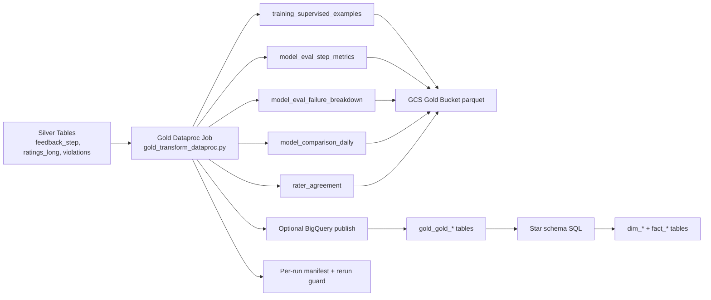

# Silver to Gold to BigQuery End-to-End Guide (Current Executed Flow)

## Why this document exists
This is the technical guide for everything implemented from **Silver to Gold and BigQuery**.
It explains:
- what Gold transforms we built,
- why we chose this storage strategy,
- how BigQuery publish works,
- what analytics data model was created,
- and how to answer deep interview questions confidently.

---

## 1) One-minute summary

Current implemented flow:
1. Read Silver curated parquet tables.
2. Build Gold marts for training + analytics.
3. Write Gold parquet to GCS Gold bucket.
4. Optionally publish Gold tables to BigQuery.
5. Build a BigQuery star schema (`dim_*`, `fact_*`) for BI/reporting.

---

## 2) Storage strategy decision (important)

### What we selected
For this project stage, we use:
- **Gold in GCS parquet** as transform output/system of record for this stage.
- **BigQuery native tables** as analytics serving layer.

### Why this is better now than Iceberg
- Simpler operations for current scale and team size.
- Faster delivery with fewer moving parts.
- Strong fit for BI SQL workloads.
- No additional catalog/format governance overhead yet.

### When Iceberg would make sense later
- heavy multi-engine table-sharing,
- advanced table-level ACID/versioning requirements at lake layer,
- frequent table evolution with strict snapshot/time-travel at storage layer.

---

## 3) Gold architecture flow

---

## 4) Implemented code and scripts

Core files:
- `src/gold/gold_transform_dataproc.py`
- `src/gold/__init__.py`
- `scripts/run_gold_dataproc.sh`
- `tests/test_gold_transform.py`
- `sql/gold_star_schema.sql`
- `scripts/run_gold_star_schema_bq.sh`

---

## 5) Gold output data model (curated marts)

Gold job creates these tables in GCS and optionally BigQuery:

1. `training_supervised_examples`
2. `model_eval_step_metrics`
3. `model_eval_failure_breakdown`
4. `model_comparison_daily`
5. `rater_agreement`

### 5.1 `training_supervised_examples`
Goal: training/retraining-friendly dataset.

Grain:
- one row per (`run_id`, `prompt_id`) latest evaluated step.

Key logic:
- picks latest `evaluated_step_index` per prompt,
- includes final answer and resolved quality metrics,
- includes violation count,
- computes average quality score.

### 5.2 `model_eval_step_metrics`
Goal: step-level analytics and model behavior diagnostics.

Includes:
- step context (task, step type, model version),
- resolved metrics,
- derived `is_bad` flag.

### 5.3 `model_eval_failure_breakdown`
Goal: identify where model fails and why.

Combines:
- label-based failures (`LLM_RATED_BAD`),
- violation-based failures (from violations table).

### 5.4 `model_comparison_daily`
Goal: daily aggregate comparison by model and task.

Includes:
- step_count,
- bad_rate,
- average scores per metric.

### 5.5 `rater_agreement`
Goal: agreement gap between human and auto-rater.

Current run notes:
- If no overlap for required join keys/metrics, output can be empty (0 rows).

---

## 6) BigQuery publishing behavior

Gold job supports optional publish with flag:
- `--publish_bigquery`

Required args when enabled:
- `--bq_project`
- `--bq_dataset`

Technical detail:
- Spark BigQuery connector requires a temporary GCS bucket.
- We configured this using Gold bucket (`temporaryGcsBucket`).

Important behavior:
- empty DataFrames are skipped, so zero-row table may not be created.

---

## 7) Idempotency and rerun safety

Gold rerun guard:
- checks manifest path before writing:
  - `.../gold/ingest_date=YYYY-MM-DD/_manifests/run_id=<run_id>.json`
- aborts if manifest already exists.

This prevents duplicate append artifacts for same run/date.

---

## 8) Star schema analytics model in BigQuery

We added star-schema SQL and runner in repo.

### 8.1 Dimensions created
- `dim_date`
- `dim_model`
- `dim_task`
- `dim_step_type`
- `dim_label`

### 8.2 Facts created
- `fact_model_eval_step`
- `fact_failure_breakdown`

### Why star schema is suitable here
- Query patterns are read-heavy analytics with common slicing dimensions.
- Easier BI joins and dashboard semantics.
- Better explainability than heavily normalized snowflake for this scale.

---

## 9) Executed run evidence (real)

### Gold to GCS run evidence
Run completed for:
- ingest_date: `2026-02-21`
- run_id: `04ace1a6-27c1-4167-8148-fc2a7e4799b1`

Manifest row counts:
- `training_supervised_examples`: 10
- `model_eval_step_metrics`: 59
- `model_eval_failure_breakdown`: 4
- `model_comparison_daily`: 1
- `rater_agreement`: 0

### Gold to BigQuery evidence
Published tables validated by row counts:
- `gold_training_supervised_examples`: 10
- `gold_model_eval_step_metrics`: 59
- `gold_model_eval_failure_breakdown`: 4
- `gold_model_comparison_daily`: 1

`gold_rater_agreement` was not created because this run had 0 rows for that output.

---

## 10) Testing and quality validation

Gold test file:
- `tests/test_gold_transform.py`

Covered logic:
1. training dataset latest-step + quality aggregation,
2. model daily comparison aggregates,
3. rater agreement absolute-delta logic.

Result:
- Gold unit tests passed.
- Dataproc runtime execution passed.
- BigQuery publish path validated.

---

## 11) Troubleshooting log (what failed and how fixed)

### Issue: BigQuery publish failed with temp bucket error
Error:
- “Either temporary or persistent GCS bucket must be set”.

Root cause:
- Spark BigQuery connector needs temp GCS staging bucket.

Fix:
- set `.option("temporaryGcsBucket", gold_bucket)` in publish writer.

Outcome:
- Gold publish to BigQuery succeeded.

---

## 12) Operational runbook (Silver -> Gold -> BigQuery)

1. Ensure Silver tables exist for target `ingest_date/run_id`.
2. Run Gold Dataproc job with optional BigQuery publish flags.
3. Verify Gold manifest row counts.
4. Verify BigQuery table row counts for target run.
5. Run star schema script from repo.
6. Validate dimension/fact tables exist.

---

## 13) Interview deep-dive Q&A (with cross-questions)

### Q1) Why keep Gold in GCS and also publish to BigQuery?
**Answer:**
Gold in GCS keeps transform outputs reproducible and cost-flexible at lake layer. BigQuery serves analytics and BI with low-latency SQL.

**Cross-question:** Isn’t this duplicate storage?
**Answer:** Yes, intentionally. It separates transformation concerns from serving concerns and improves operational flexibility.

---

### Q2) Why star schema and not snowflake?
**Answer:**
For this dataset, star schema is simpler and performant enough. Dimensions are small and reused often; fact tables are straightforward for BI.

**Cross-question:** When would snowflake be better?
**Answer:** If dimensions become very large, hierarchical, and repeatedly redundant, deeper normalization may reduce duplication.

---

### Q3) Why not Iceberg tables?
**Answer:**
Current stage prioritizes delivery speed, simplicity, and BigQuery-native analytics. Iceberg is useful, but it adds metadata/catalog complexity not needed yet.

**Cross-question:** Is this a long-term limitation?
**Answer:** No. Architecture allows migration later if scale/governance requirements demand lakehouse table formats.

---

### Q4) How do you prove Gold publish works reliably?
**Answer:**
By combining:
- successful Dataproc batch completion,
- manifest row counts,
- BigQuery row-count validation queries,
- repeatable repo scripts.

---

### Q5) What if some Gold table has zero rows?
**Answer:**
Then publish may skip table creation. This is expected behavior with current logic. If BI requires table existence always, add explicit empty-table creation logic.

---

## 14) Technical terms (simple)

- **Serving layer**: where users/tools query data for analytics.
- **Fact table**: measurable events/metrics.
- **Dimension table**: descriptive context used to slice facts.
- **Star schema**: facts in center, dimensions around it.
- **Snowflake schema**: more normalized dimensions across multiple layers.

---

## 15) Suggested next hardening before orchestration

1. Ensure empty-output BigQuery tables can still be created (optional).
2. Add validation script comparing manifest counts vs BigQuery counts automatically.
3. Add CI gate for Gold tests.
4. Add one-command orchestration script after these checks.
